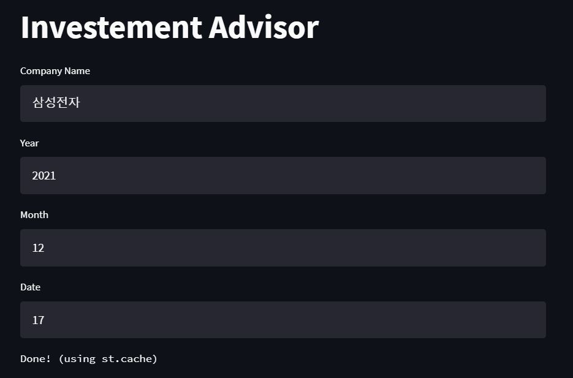
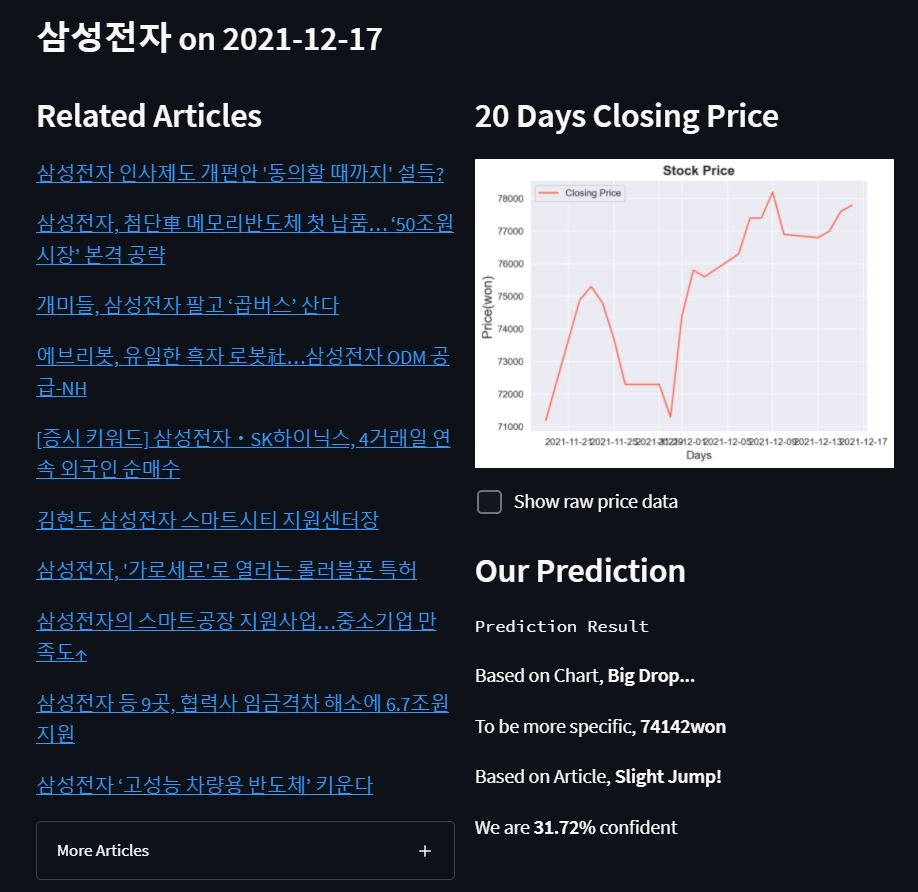
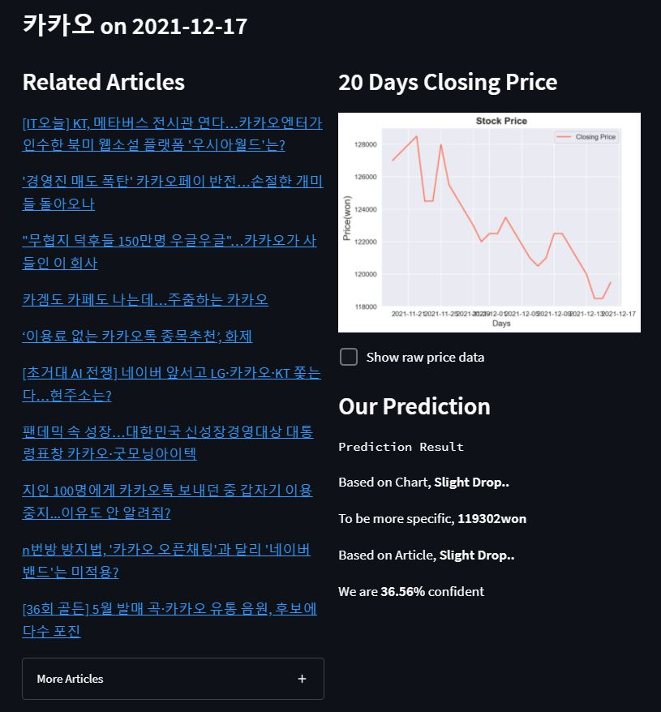

# Investment Advisor: Stock Price Fluctuation Predictioin using News and Chart
Team 3 project repo for CS 492 - Introduction to Deep Learning course  
We implemented two-fold predictor for coming trading day's stock price fluctuation  
Look at below diagram   


## Quickstart
1. Download two pretrained BERT models from my google drive and place them on _pretrained_models_ directory  
Link [here](pretrained_models/README.md), those two would take **1.3GB** disk in total  

2. Install required python modules using below command  
Please set up your own venv before downloading these modules if you have your own setups!
```
$ pip install -r requirements.txt
```  
  
3. Run below command on main directory of this project  
Downloading pretrained multilingual BERT may take **7GB** in disk, thus, make enough space before running this command  
```
$ streamlit run simple_web.py
```

## Use Case

You can see the above screen on top, when you run our application.  
Our default setting is '삼성전자' on 2021-12-17.  
You may type in other companies or date to get a prediction.  
| Samsung Electronics | KAKAO |
| ------ | ------ |
|  |  |

**Caution** If the date to predict is too far, you may fail to get related articles!